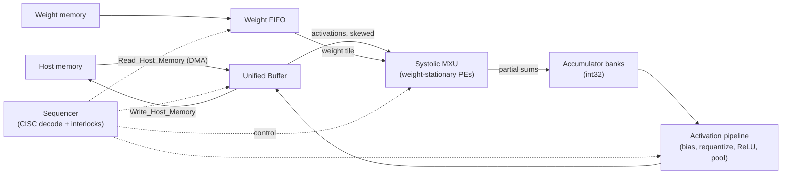
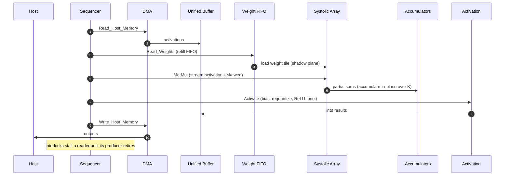

<div align="center">

# Mini-TPU

**A cycle-accurate TPUv1-style int8 inference accelerator**

`C++17` · `Systolic array` · `Cycle-accurate`

Single-chip, cycle-accurate microarchitectural simulator of a weight-stationary
systolic matrix unit, a unified on-chip buffer, int32 accumulator banks, a weight
FIFO, and a CISC instruction sequencer that overlaps long-running matmul,
activation, and DMA instructions.

</div>

---

## Contents

| § | Section | Summary |
|---|---|---|
| [1](#1-goals--non-goals) | Goals / Non-Goals | What the accelerator does and deliberately does not do |
| [2](#2-system-architecture) | System Architecture | Blocks, dataflow, and instruction lifecycle |
| [3](#3-systolic-array-mxu) | Systolic Array (MXU) | Weight-stationary PEs, skew, fill/drain, double buffering |
| [4](#4-memory-subsystem) | Memory Subsystem | Unified Buffer banking, accumulators, weight FIFO, DMA |
| [5](#5-instruction-set--sequencer) | Instruction Set & Sequencer | CISC ops, encoding, in-order issue with interlocks |
| [6](#6-activation-pipeline) | Activation Pipeline | Bias, requantize, ReLU, pooling |
| [7](#7-data--control-flow-summary) | Data / Control Flow | End-to-end path for one tiled matmul |
| [8](#8-testing--validation) | Testing & Validation | Reference-model differential testing |
| [9](#9-performance-characterization) | Performance Characterization | Utilization, TOPS, roofline, stall causes |
| [10](#10-scope--future-work) | Scope / Future Work | Op coverage and post-v1 directions |

---

## 1. Goals / Non-Goals

### Goals

| Goal | Mechanism |
|---|---|
| Bit-exact int8 inference | Integer-only matmul into int32 accumulators, then fixed-point requantization |
| Deterministic, reproducible timing | Fixed-function pipeline; no speculation, no wall-clock, no randomness |
| Full array utilization on large tiles | Weight-stationary dataflow with activation skew and one output column per cycle at steady state |
| Latency hidden behind compute | Double-buffered weight planes and overlapped `MatMul` / `Activate` / DMA instructions |
| Configurability without recompilation | Every structural parameter is a `Config` field |

### Non-Goals

- **Training.** Forward-pass inference only — no backward pass, no gradients, no optimizer state.
- **Floating point.** int8 activations and weights, int32 accumulation, fixed-point requantization. No F/D datapath.
- **Caches, TLBs, coherence.** The Unified Buffer is explicitly managed scratchpad, not a cache; host memory is a flat array with a fixed DMA bandwidth.
- **Multi-chip / pods.** Single accelerator, single sequencer. No inter-chip interconnect.
- **RTL fidelity.** This is a cycle-accurate C++ model of a datapath, not synthesizable hardware.
- **Sparsity / compression.** Dense tensors only; no zero-skipping or weight compression.

---

## 2. System Architecture

The accelerator is a host-driven scratchpad machine: DMA moves tensors between host memory and the Unified Buffer, the systolic array multiplies a resident weight tile by a stream of activations into accumulators, and the activation pipeline requantizes results back into the buffer.

```
Read_Host_Memory → Read_Weights → MatMul → Activate → Write_Host_Memory
        (DMA)          (FIFO)      (MXU)   (act pipe)      (DMA)
```



### Instruction lifecycle

```
fetch → decode → issue (interlock check on UB regions + accumulator banks)
      → weight load (FIFO → array) | activation stream (UB → array, skewed)
      → MAC across the array
      → accumulate into a bank (accumulate-in-place for K-tiling)
      → activate (bias, requantize, ReLU, pool)
      → write back to UB → DMA to host
```

Stages are evaluated in **reverse pipeline order** (writeback before compute before issue before fetch) so each stage observes the previous cycle's output of its producer — the inter-stage registers behave as latches, exactly as in the Mini-CPU model.

### What replaces out-of-order execution

A CPU extracts parallelism from a scalar instruction stream, so it needs renaming, an issue queue, and speculative recovery. A TPU does not: parallelism is **inside** each instruction — a single `MatMul` is tens of thousands of MACs. The performance lever is therefore **overlap**, not reordering:

| CPU mechanism | TPU counterpart |
|---|---|
| Out-of-order issue queue | In-order issue; long instructions overlap in different units |
| Register renaming (WAW/WAR removal) | UB-region and accumulator-bank interlocks in a scoreboard |
| Branch speculation + recovery | None — control flow is a straight-line instruction stream |
| Bypass network for 1-cycle wakeup | Systolic pass-through; results march out of the array on a fixed schedule |

Nothing is speculative, so nothing is ever squashed. Correctness reduces to two questions: does each instruction compute the right tensor, and does the interlock logic never let a consumer read a buffer region before its producer finished writing it.

---

## 3. Systolic Array (MXU)

### 3.1 Processing element

The array is a `dim × dim` grid of processing elements (default `dim = 32`). Each PE holds:

- A **weight register** (int8) — the stationary operand for the resident tile.
- One **int8 × int8 multiplier** and one **int32 adder** — one MAC per cycle.
- **Pass-through registers** — the activation flows left-to-right, the partial sum flows top-to-bottom, each delayed one cycle per hop.

```text
        act_in →──┬───────→ act_out (next cycle)
                  │
              [ w ]  ← stationary weight
                  │
   psum_in ↓──────+──────↓ psum_out = psum_in + act_in * w
```

### 3.2 Weight-stationary dataflow

Weights are loaded once per tile and stay put while a stream of activation columns flows through. A `dim × dim` weight tile multiplied by `N` activation columns produces `N` output columns, one per cycle at steady state.

The array is fed **skewed**: row `r` of the activation stream is delayed by `r` cycles so that all products contributing to one output element meet in the same PE on the same cycle. Results emerge from the bottom edge equally skewed and are de-skewed into an accumulator bank.

### 3.3 Fill and drain

A tile has a fill/drain latency of `2·dim − 1` cycles: `dim − 1` cycles for the first activation to reach the bottom-right PE, plus `dim` cycles for the last column to drain out. For `N` activation columns the matmul occupies the array for `N + 2·dim − 1` cycles, so utilization is `N / (N + 2·dim − 1)` — the reason large `N` (deep activation streams) is what makes a systolic array efficient.

### 3.4 Double-buffered weights

Each PE has **two** weight registers, an active plane and a shadow plane. `Read_Weights` loads the shadow plane while the active plane is still multiplying; a `MatMul` that switches planes costs zero load bubble. With double buffering disabled (a config knob), the next tile cannot begin until its weights finish loading — exactly `dim` cycles of bubble — which is the property test that proves the feature works.

### 3.5 Partial tiles

When a matmul dimension is smaller than `dim`, the array is zero-padded: unused weight rows are loaded with zero, unused activation columns are not streamed. The result is correct but utilization drops, and the wasted PE-cycles are attributed to `partial_tile_waste` in the stall breakdown so a poorly-tiled workload is visible rather than silently slow.

---

## 4. Memory Subsystem

### 4.1 Unified Buffer

A single large on-chip scratchpad (default 256 KiB, TPUv1 configuration 24 MiB) holding activations and intermediate results. It is **banked**; each bank exposes one read port and one write port per cycle. Two reads targeting the same bank in one cycle is a **bank conflict** and stalls one of them, counted as `ub_bank_conflict`. Addresses are byte offsets; tensors are row-major with an explicit stride so a tile is a strided rectangular view.

### 4.2 Accumulator banks

Results land in int32 **accumulator banks** addressed `[bank][row][col]`. A `MatMul` either overwrites a bank or **accumulates in place** into it — the latter is how the K dimension is tiled: successive `MatMul`s over slices of K add into the same bank before a single `Activate` reads it out. A bank being written by an in-flight matmul is locked; an `Activate` or `MatMul` that would read or accumulate it stalls (`accum_hazard`).

### 4.3 Weight FIFO

Weight tiles are staged from weight memory (DDR) through a **weight FIFO** of configurable depth. `Read_Weights` pops a tile from the FIFO into the array's shadow plane; if the FIFO is empty the instruction stalls (`weight_fifo_empty`). A background refill models DDR bandwidth as a fixed per-tile latency.

### 4.4 Host DMA

`Read_Host_Memory` and `Write_Host_Memory` move byte ranges between host memory and the Unified Buffer at a configurable **bandwidth** (bytes/cycle). A DMA occupies its endpoint's UB port for its duration; a workload whose DMA time exceeds its compute time is DMA-bound and reports `dma_bound` as its dominant stall.

| Structure | Default size | Port budget |
|---|---|---|
| Unified Buffer | 256 KiB, N banks | 1R + 1W per bank per cycle |
| Accumulators | 4 banks × `dim` × `dim` int32 | 1 accumulate + 1 read per bank |
| Weight FIFO | 4 tiles deep | 1 push (refill) + 1 pop per cycle |
| Host DMA | 16 bytes/cycle | shares a UB port |

---

## 5. Instruction Set & Sequencer

### 5.1 The instruction set

A small CISC set — each instruction is a whole tensor operation, not a scalar op.

| Opcode | Operands | Effect |
|---|---|---|
| `Read_Host_Memory` | host_addr, ub_addr, bytes | DMA host → Unified Buffer |
| `Read_Weights` | ddr_addr, tile | Stage a weight tile into the weight FIFO / shadow plane |
| `MatMul` | ub_src, len, acc_bank, accumulate | Stream activations through the array into an accumulator bank |
| `Activate` | acc_bank, ub_dst, func, bias, mult, shift | Bias, requantize, activation function, optional pool → UB |
| `Write_Host_Memory` | ub_addr, host_addr, bytes | DMA Unified Buffer → host |
| `Sync` | — | Barrier: stall issue until all in-flight instructions retire |
| `NOP` | — | No operation |
| `Halt` | code | Stop the machine, return `code` |

### 5.2 Encoding

Fixed-width instruction words with an opcode field and packed operand fields; immediates (addresses, lengths, requantization multiplier/shift) are decoded once in the decoder and never re-derived at a use site. Unknown opcodes decode to a trap that halts the machine rather than executing undefined behavior.

### 5.3 In-order issue with interlocks

The sequencer issues **in order**. Before an instruction issues, a small **scoreboard** checks its operands against in-flight instructions:

- A reader of a UB region stalls until the writer of that region retires.
- An accumulator consumer stalls until its producing `MatMul` finishes.
- A structural resource (array busy, DMA engine busy, FIFO empty) stalls the issue.

Once issued, an instruction runs to completion in its unit while the sequencer continues issuing independent instructions into other units. This is the entire concurrency model: **in-order issue, overlapped execution, interlock-gated**.

### 5.4 Why CPI is large and why that is fine

A single `MatMul` on a 256×256 array streaming a 256-deep activation tile takes ~500 cycles and does ~16.7M MACs. Instruction throughput is low by CPU standards, but *operation* throughput is enormous. The performance question is never "how many instructions per cycle" but "what fraction of the array's MACs are doing useful work", so §9 characterizes **utilization and TOPS**, not IPC.

---

## 6. Activation Pipeline

`Activate` reads an accumulator bank and streams it through a fixed pipeline back into the Unified Buffer.

### 6.1 Stages

1. **Bias add** — add a per-column int32 bias.
2. **Requantize** — scale the int32 accumulator back to int8 (see §6.2).
3. **Activation function** — identity, ReLU, or ReLU6, applied on the requantized value.
4. **Pool** (optional) — max or average pooling over a window before writeback.

The pipeline is throughput-1: after fill it emits one requantized element per cycle, so `Activate` on `M` elements costs `M + pipeline_depth` cycles.

### 6.2 Requantization (the correctness hot spot)

Converting int32 back to int8 uses a fixed-point multiply-and-shift:

```text
scaled = round( acc * multiplier / 2^shift )      # round half away from zero
out    = clamp(scaled, -128, 127)                   # saturating int8
```

This is the single highest-risk area for correctness — the analog of the CPU model's divide-by-zero and signed-overflow edge cases. The rounding mode (half away from zero vs. banker's rounding), the sign behavior of the arithmetic shift on negative accumulators, and saturation at **both** clamp boundaries are each a distinct bug magnet and each gets an explicit differential test against the reference model. Getting any of them wrong produces an output that is off by one in a handful of elements — plausible-looking and hard to eyeball, which is why it is pinned by an exhaustive test rather than a spot check.

### 6.3 Pooling

Max and average pooling operate on the requantized int8 stream with a configurable window and stride. Average pooling rounds the same way as requantization so the two share one rounding helper and one set of edge-case tests.

---

## 7. Data / Control Flow Summary



---

## 8. Testing & Validation

### 8.1 Differential correctness

Every cycle-accurate result is checked against an **eager reference model** — a straight-line int8 matmul / requantize / pool implementation with no timing model at all. The reference is obviously correct by inspection; the cycle-accurate machine is not. Comparing the two is the backbone of the whole test strategy.

| Comparand | Purpose |
|---|---|
| Output tensor, byte-for-byte | Numerical correctness of matmul + requantize + pool |
| Accumulator contents at each `Sync` | Localizes a bug to before/after a barrier |
| Retired-instruction count | No instruction is dropped or double-issued |

The workload set covers: dense MLP layers, an LSTM-shaped batch of gate matmuls, a convolution lowered via im2col, a K-tiled matmul (accumulate-in-place), partial-tile edge shapes (`N`, `M`, `K` each smaller than `dim`), pooling, per-channel requantization, and a full three-layer MLP end to end.

### 8.2 Configuration sweep

Each workload runs on **six configurations**:

| Configuration | Purpose |
|---|---|
| Default (32×32) | Baseline |
| 8×8 array | Small-array correctness, high fill/drain overhead |
| 256×256 array | TPUv1-scale utilization |
| Single-bank UB | Bank-conflict stress |
| 1-deep weight FIFO | Weight-FIFO-empty stress |
| Low DMA bandwidth | DMA-bound regime |

Any dataflow, skew, interlock, or requantization bug shows up as a **configuration-dependent** failure — numerical correctness on one array size that breaks on another localizes the fault to the timing or padding logic rather than the arithmetic.

### 8.3 Microarchitectural property assertions

Beyond numerical correctness, targeted tests assert:

- A `dim × dim` tile fed `N ≥ dim` columns completes in exactly `N + 2·dim − 1` cycles at >90% utilization.
- Back-to-back matmuls on different weight tiles show **zero** weight-load bubble with double buffering, and exactly `dim` cycles of bubble without it.
- Requantization is bit-exact across an exhaustive sweep of accumulator values and several multiplier/shift pairs, including ties and both saturation clamps.
- A workload below the roofline ridge point scales with **bytes moved**, not MACs, and reports `dma_bound` as its dominant stall.
- A single-bank UB config reports `ub_bank_conflict` as the dominant stall on a workload that a many-bank config runs conflict-free.

---

## 9. Performance Characterization

### 9.1 Default configuration

| Parameter | Value |
|---|---|
| Array (`dim`) | 32 × 32 PEs |
| MAC width | int8 × int8 → int32 |
| Unified Buffer | 256 KiB, 8 banks |
| Accumulator banks | 4 × 32 × 32 int32 |
| Weight FIFO | 4 tiles deep |
| Weight double buffering | enabled |
| DMA bandwidth | 16 bytes/cycle |
| Activation functions | identity, ReLU, ReLU6 |
| Pooling | max, average |
| Requantization | multiply + arithmetic shift, round half away from zero, saturating int8 |

### 9.2 Utilization and TOPS by array size

Populated by `make test` — the table is reproducible from the bundled workloads, not hand-entered.

| Workload | 8×8 util | 32×32 util | 256×256 util |
|---|---|---|---|
| mlp_dense | TBD | TBD | TBD |
| conv_im2col | TBD | TBD | TBD |
| matmul_ktiled | TBD | TBD | TBD |
| lstm_gates | TBD | TBD | TBD |

### 9.3 Roofline

The ridge point is where a workload transitions from memory-bound to compute-bound — arithmetic intensity (MACs per byte moved) equal to peak-MACs / DMA-bandwidth. Workloads left of the ridge (small matmuls, low reuse) are DMA-bound and do not benefit from a larger array; workloads right of it (deep dense layers) saturate the MXU. The sweep places each workload on the roofline and confirms the dominant stall cause matches its side of the ridge.

### 9.4 Reported statistics

Utilization, effective TOPS, per-instruction cycle counts, DMA bytes moved, weight-load bubble cycles, and a **stall-cause breakdown** attributing lost array-cycles to: `weight_fifo_empty`, `ub_bank_conflict`, `accum_hazard`, `dma_bound`, `array_fill_drain`, and `partial_tile_waste`.

---

## 10. Scope / Future Work

### Op scope

- **Implemented:** int8 matmul into int32 accumulators, accumulate-in-place K-tiling, bias, fixed-point requantization, identity / ReLU / ReLU6, max / average pooling, host DMA.
- **Lowered in the tiler:** dense (fully-connected) layers, convolution via im2col.
- **Trap-and-halt:** unknown opcodes, `Halt`.
- **Not implemented:** floating point, backward pass / training, sparsity, multi-chip, on-chip network, dynamic control flow.

### Post-v1 directions

- **bf16 MXU** — a floating-point datapath to compare accuracy and utilization against the int8 baseline.
- **Output-stationary / row-stationary dataflow** — the same array with a different mapping, to measure the reuse trade-off the weight-stationary choice makes.
- **A real tiling compiler** — replace the hand-written tiler with a cost-model-driven one that chooses tile shapes from a layer spec.
- **HBM with banking contention** — replace the fixed DMA bandwidth with a banked memory model so DMA scheduling becomes a real optimization.
- **Sparsity** — zero-skipping in the array and a compressed weight format, the single largest lever for real-model efficiency.
