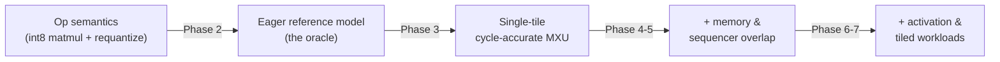
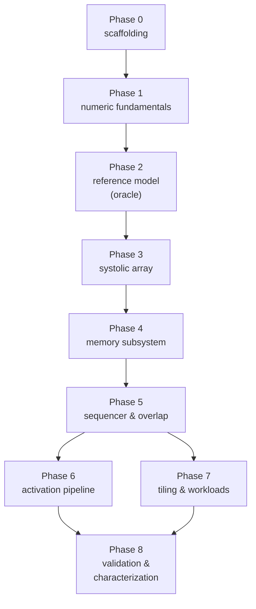

<div align="center">

# Build Plan

**Implementation roadmap for [`DESIGN.md`](./DESIGN.md)**

34 steps · one source file and one test section per step

</div>

---

## Contents

| Phase | Focus | Steps | Design ref |
|---|---|---|---|
| [0](#phase-0--scaffolding) | Scaffolding | 0.1–0.3 | — |
| [1](#phase-1--numeric-fundamentals) | Numeric fundamentals | 1.1–1.4 | [§5](./DESIGN.md#5-instruction-set--sequencer), [§6](./DESIGN.md#6-activation-pipeline) |
| [2](#phase-2--the-reference-model-your-oracle) | Reference model (the oracle) | 2.1–2.3 | [§8.1](./DESIGN.md#81-differential-correctness) |
| [3](#phase-3--systolic-array) | Systolic array | 3.1–3.5 | [§3](./DESIGN.md#3-systolic-array-mxu) |
| [4](#phase-4--memory-subsystem) | Memory subsystem | 4.1–4.5 | [§4](./DESIGN.md#4-memory-subsystem) |
| [5](#phase-5--sequencer--overlap) | Sequencer & overlap | 5.1–5.5 | [§5](./DESIGN.md#5-instruction-set--sequencer) |
| [6](#phase-6--activation-pipeline) | Activation pipeline | 6.1–6.3 | [§6](./DESIGN.md#6-activation-pipeline) |
| [7](#phase-7--tiling--workloads) | Tiling & workloads | 7.1–7.3 | [§8.1](./DESIGN.md#81-differential-correctness) |
| [8](#phase-8--validation--characterization) | Validation & characterization | 8.1–8.3 | [§8](./DESIGN.md#8-testing--validation), [§9](./DESIGN.md#9-performance-characterization) |

Supporting material: [How to use this plan](#how-to-use-this-plan) · [The oracle strategy](#the-oracle-strategy) ·
[Environment](#environment) · [Repo layout](#repo-layout) · [Test conventions](#test-conventions) ·
[Dependency graph](#dependency-graph)

---

## How to use this plan

Every step is the same loop. Do them in order; each one is small enough to finish in a sitting
and leaves the repo in a green state.

```
1. READ    the DESIGN.md section the step cites — before writing any code
2. PREDICT write down what you expect the test to show (a cycle count, a utilization number, a stall cause)
3. WRITE   the one source file
4. TEST    the one test section, run it, and reconcile it against your prediction
5. COMMIT  only when the step's "Done when" criteria all hold
```

Step 2 is the part people skip and the part that produces the learning. If a matmul takes
`N + 3·dim` cycles when you predicted `N + 2·dim − 1`, you have found either a skew bug or a
gap in your mental model of fill/drain, and it is worth stopping to work out which before
moving on.

**Rules that keep the plan honest**

- **One source file per step.** If a step seems to need two, the step is wrong — split it.
- **Never delete a working slower path.** The eager reference model from Phase 2 becomes the
  oracle for every Phase 3–8 result. That is the backbone of the whole plan.
- **The test suite only grows.** A step is not done if it broke an earlier test.
- **Measure only after correct.** Every timing change is compared for numerical correctness
  against the reference *before* its utilization is reported.

---

## The oracle strategy

The central difficulty in an accelerator simulator is that a wrong answer often still looks
like a plausible tensor. The array "runs", numbers come out, the shapes are right — but a few
elements are off by one because the skew was wrong by a cycle or the requantization rounded the
wrong way. You cannot eyeball a 32×32 int8 tile. So the plan is built around **differential
testing**: every cycle-accurate component is checked against a simple, obvious one that already
passed.



Each arrow is a test — the same workloads driven through both layers, comparing the output
tensor byte-for-byte, the accumulator contents at each `Sync`, and the retired-instruction
count. The chain means a Phase 7 bug can be bisected by walking backwards until a layer agrees
with the reference again, which localizes the fault to one hop.

Two consequences worth internalizing:

- **Phase 2 exists only to build the oracle.** It ships no feature from the design doc.
  Skipping it makes every later phase untestable — you would be comparing a timing model
  against itself, which cannot catch a systematic arithmetic bug.
- **Tensor comparison is your friend.** Two correct implementations must produce a
  **byte-identical** output tensor and the same retired-instruction count. That is a far
  sharper signal than eyeballing a heatmap.

---

## Environment

| Component | Requirement | Consequence for the plan |
|---|---|---|
| Toolchain | C++17, any GCC ≥ 9 or Clang ≥ 10 | Modern lambdas, `std::optional`, structured bindings |
| Build | `make` | Single Makefile; no CMake / Bazel machinery to fight |
| Sanitizers | ASan + UBSan | `make debug` builds run the full suite instrumented — catches out-of-bounds bank indexing a functional test misses |
| ML framework | **not required** | `tests/tpuasm.h` builds programs in-process; `tools/gen_examples.cpp` emits tensors |
| Reference numerics | in-tree | `tests/ref.h` is a plain integer matmul; no NumPy / TensorFlow dependency |

**On writing the reference in the test tree.** A NumPy or TensorFlow dependency turns a
five-minute clone-and-build into a Python-environment hunt. The in-tree reference covers int8
matmul, fixed-point requantization, the activation functions, and pooling in a few hundred
lines — enough to validate every bundled workload — with no external package. A `--npy`
loader remains the escape hatch for anyone who wants to feed in tensors from a real framework.

---

## Repo layout

The end state. Create directories as their first file arrives, not up front.

```text
Mini-TPU/
├── Makefile                    0.1
├── src/
│   ├── types.h                 0.2
│   ├── config.h                0.3
│   ├── tensor.h                1.1
│   ├── quant.h                 1.2
│   ├── isa.h                   1.3
│   ├── decoder.h               1.3
│   ├── decoder.cpp             1.3
│   ├── loader.h                1.4
│   ├── main.cpp                1.4, 8.3
│   ├── pe.h                    3.1
│   ├── mxu.h                   3.2, 3.3, 3.4, 3.5
│   ├── unified_buffer.h        4.1
│   ├── accumulators.h          4.2
│   ├── weight_fifo.h           4.3
│   ├── dma.h                   4.4
│   ├── stats.h                 8.1
│   ├── tpu.h                   4.5, 5.1-5.5, 6.1-6.3
│   └── tpu.cpp                 (extends with each step above)
├── tests/
│   ├── tpuasm.h                2.1
│   ├── ref.h                   2.2
│   └── test_main.cpp           2.3 + one @section per later step
└── tools/
    └── gen_examples.cpp        7.1, 7.2, 7.3
examples/                       generated
```

**Why `tpu.{h,cpp}` accumulates across the plan.** The sequencer and its units are one state
machine — splitting them into separate files would force `friend` declarations across every
private member and lose the property that `tick()` is one readable function. Each stage step
adds one method (`Tpu::issue`, `Tpu::run_matmul`, …) and extends `tick()` by one line. If the
file feels too large by Phase 6, that is the moment to split — not before.

---

## Test conventions

Established once in [Step 2.3](#step-23--test-harness--differential-runner) and used by every later step.

| Kind | Meaning | Invoked by |
|---|---|---|
| **Reference-diff** | Run workload through both `Tpu` and `ref.h`; compare output tensor, accumulators at sync, retired count | `make test` |
| **Property assertion** | A specific microarchitectural invariant (fill/drain cycles, zero weight-load bubble) | `make test` |
| **Configuration sweep** | Same workload across the six configurations from [§8.2](./DESIGN.md#82-configuration-sweep) | `make test` |
| **Sanitized run** | Whole suite under ASan + UBSan | `make debug` |

Conventions that pay off later:

- **Deterministic simulation.** No wall-clock time, no `rand()` — every arbitration is
  index-ordered. A failure at cycle 41,382 must reproduce on the next run, bit-identical, or
  debugging is dead.
- **Every test is a differential test until proven otherwise.** Only assert absolute numbers
  (e.g. "exactly `N + 2·dim − 1` cycles") in the microarchitectural property tests, and only
  when the number is the point of the test.
- **`--trace` is a first-class debug tool.** Add it in [Step 1.4](#step-14--program--tensor-loaders--cli); every later step should be
  reproducible from a trace diff.

---

## Phase 0 — Scaffolding

Three steps, then you never think about tooling again.

#### Step 0.1 — Makefile & warning flags

**Write** `Makefile` · **Test** `make && ./build/minitpu --help` prints usage

- Targets: `build/minitpu`, `make test`, `make debug`, `make clean`.
- Flags: `-std=c++17 -O2 -Wall -Wextra -Wpedantic`; the `debug` target adds
  `-fsanitize=address,undefined -g -O1`.
- Auto-regenerate `examples/*` from `tools/gen_examples.cpp` as a prerequisite of `test`.

**Done when:** `make` produces `build/minitpu` with no warnings; `make debug` produces
`build/minitpu-debug` under ASan+UBSan; `make clean` returns the tree to a pristine state.

#### Step 0.2 — Fundamental types

**Write** `src/types.h` · **Test** `tests/test_main.cpp @section("types")`

- Integer aliases: `i8`, `i32`, `UbAddr`, `HostAddr`, `BankId`, `TileId`. `constexpr`
  `INVALID_*` sentinels rather than `-1` sprinkled through the code.
- `enum class Op { READ_HOST, READ_WEIGHTS, MATMUL, ACTIVATE, WRITE_HOST, SYNC, NOP, HALT }` —
  the class that drives every dispatch decision from Phase 5 onward.
- `enum class ActFn { IDENTITY, RELU, RELU6 }` and `enum class Pool { NONE, MAX, AVG }`.

**Done when:** the header compiles standalone; the sentinels round-trip through the
`std::optional` idiom used by the scoreboard in [Step 5.2](#step-52--scoreboard--interlocks).

#### Step 0.3 — Config

**Write** `src/config.h` · **Test** `tests/test_main.cpp @section("config")`

- A POD struct: `dim`, `ub_bytes`, `ub_banks`, `acc_banks`, `weight_fifo_depth`,
  `double_buffer`, `dma_bytes_per_cycle`, `ddr_tile_latency`, `act_pipeline_depth`.
- `bool dma_bound(size_t macs, size_t bytes) const` — the roofline ridge-point predicate
  from [§9.3](./DESIGN.md#93-roofline).
- Defaults matching [§9.1](./DESIGN.md#91-default-configuration).

**Done when:** every knob is one field; `dma_bound` agrees with the roofline for a
hand-computed workload; nothing downstream will hardcode a size.

> **Learn:** every configurability decision starts as a `Config` field. The temptation to
> hardcode "just a 32×32 array for now" is the temptation to rewrite Phase 3.

---

## Phase 1 — Numeric fundamentals

Everything that touches tensors and arithmetic and nothing that touches timing. These files
stay stable from Phase 1 through Phase 8 — the timing machinery is layered on top without
changing the numerics.

Design reference: [§5](./DESIGN.md#5-instruction-set--sequencer), [§6](./DESIGN.md#6-activation-pipeline).

#### Step 1.1 — Tensor container

**Write** `src/tensor.h` · **Test** `tests/test_main.cpp @section("tensor")`

- A row-major int8 (and int32, for accumulators) tensor view with explicit shape and stride, so
  a tile is a strided rectangular window into the Unified Buffer's byte array.
- Helpers: `at(row, col)`, `tile(r0, c0, rows, cols)`, `fill`, `zero_pad`.

**Done when:** a strided sub-tile reads and writes the same elements as an equivalent manual
index computation; a partial tile zero-pads correctly for [§3.5](./DESIGN.md#35-partial-tiles).

#### Step 1.2 — Quantization / requantization

**Write** `src/quant.h` · **Test** `tests/test_main.cpp @section("quant")`

- `requantize(i32 acc, i32 multiplier, int shift) -> i8`: multiply, arithmetic-shift with
  round-half-away-from-zero, saturating clamp to `[-128, 127]` ([§6.2](./DESIGN.md#62-requantization-the-correctness-hot-spot)).
- The same rounding helper is reused by average pooling ([§6.3](./DESIGN.md#63-pooling)).

**Done when:** every requantization edge case has a test — a tie rounds away from zero, a large
positive saturates to `127`, a large negative to `-128`, and a negative accumulator shifts with
the correct sign. This is the div-edge-case equivalent; getting it wrong shows up in Phase 6 as
a handful of off-by-one output elements.

> **Learn:** the requantization edge cases are in the quantization spec for a reason. Getting
> the rounding or saturation wrong here is invisible until a full-layer differential test fails
> on 3 of 1024 elements and you spend two hours bisecting.

#### Step 1.3 — Instruction set + decoder

**Write** `src/isa.h`, `src/decoder.h`, `src/decoder.cpp` · **Test** `tests/test_main.cpp @section("decode")`

- One `Decoded` struct per instruction: `Op`, operand fields (addresses, lengths, bank ids,
  `accumulate` flag, `ActFn`, `Pool`, `multiplier`, `shift`).
- Cover the eight opcodes from [§5.1](./DESIGN.md#51-the-instruction-set). Decode immediates once; never re-derive at a use site.

**Done when:** a hand-picked set of instructions (all eight opcodes, both activation functions,
both pool modes) decode to the expected struct; an unknown opcode decodes to `HALT`-with-trap
rather than undefined behavior.

#### Step 1.4 — Program & tensor loaders + CLI

**Write** `src/loader.h`, `src/main.cpp` · **Test** `tests/test_main.cpp @section("loader")`

- Load a program (list of encoded instructions) and input tensors from a flat binary / hex
  format, plus an optional `--npy`-like loader as the real-framework escape hatch.
- CLI: `--prog`, `--weights`, `--acts`, `--regs`/`--dump`, `--trace`, and every `Config` field
  as `--dim`, `--ub`, etc. For now, run the program through the reference model (added in
  [Step 2.2](#step-22--eager-reference-model)) and print the output tensor.

**Done when:** loading tensors via each format lands the same bytes; `--help` lists every knob;
every `Config` field has a `--flag`.

---

## Phase 2 — The reference model (your oracle)

This phase adds **no feature from the design doc**. Its entire purpose is to produce a
known-correct, eager tensor model that every later phase is tested against. Skipping it is the
single most likely way to end up with a simulator that produces plausible garbage.

Design reference: [§8.1](./DESIGN.md#81-differential-correctness).

#### Step 2.1 — In-tree program builder

**Write** `tests/tpuasm.h` · **Test** `tests/test_main.cpp @section("tpuasm")`

- Header-only builder emitting the eight opcodes into a `std::vector` of encoded instructions,
  with symbolic UB/accumulator/tile operands so a test reads like a short program.
- Helpers for the common shapes: `read_host`, `read_weights`, `matmul`, `activate`,
  `write_host`, `sync`, `halt`.

**Done when:** every instruction the tests in [Step 2.3](#step-23--test-harness--differential-runner) will emit builds to a byte-exact
match against a hand-checked reference encoding.

> **Learn:** avoiding an ML-framework dependency at the *test* boundary is what keeps the
> project cloneable in five minutes. This is worth the two hundred lines.

#### Step 2.2 — Eager reference model

**Write** `tests/ref.h` · **Test** `tests/test_main.cpp @section("ref")`

- Straight interpreter: for each instruction, do the whole tensor op immediately — int8 matmul
  into an int32 accumulator, accumulate-in-place, bias, requantize ([Step 1.2](#step-12--quantization--requantization)),
  activation, pool, DMA. No timing, no array, no FIFO.
- Honour `Halt` as `exit(code)`.

**Done when:** a handful of small programs (a dense matmul, a K-tiled matmul, a ReLU layer, a
pooling op) run to completion with expected output tensors; a partial-tile shape produces the
correct zero-padded result.

#### Step 2.3 — Test harness + differential runner

**Write** `tests/test_main.cpp` · **Test** *(itself)*

- One driver, one `@section(name)` macro per group of assertions, `make test` runs the whole
  file.
- A `diff_run(prog, config)` helper that runs the program through `Tpu` (once Phase 3 exists)
  and `ref.h`, comparing the output tensor, accumulator contents at each `Sync`, and retired
  count.

**Done when:** the harness compiles and runs; a placeholder `@section("diff_scaffold")` that
compares `ref.h` against itself passes trivially — proving the compare logic works before any
`Tpu` implementation exists to compare against.

> **Learn:** the compare logic passing against itself is the sanity check that catches a bug in
> `diff_run` itself. If you introduced `Tpu` first and the diff failed, you would not know
> whether the bug is in the array or the harness.

---

## Phase 3 — Systolic array

Now the cycle-accurate array — but standalone, driven directly by a test, not yet wired to the
sequencer. This is the compute core into which every Phase 4–6 mechanism feeds, and testing it
thoroughly is what makes adding the memory system and sequencer a series of localized changes
instead of a rewrite.

Design reference: [§3](./DESIGN.md#3-systolic-array-mxu).

#### Step 3.1 — Processing element

**Write** `src/pe.h` · **Test** `tests/test_main.cpp @section("pe")`

- One PE: weight register(s), an int8×int8→int32 MAC, and pass-through registers for the
  activation (left→right) and partial sum (top→bottom) ([§3.1](./DESIGN.md#31-processing-element)).
- A `tick(act_in, psum_in) -> {act_out, psum_out}` that advances one cycle.

**Done when:** a single PE fed a known activation and weight produces `psum_in + act·w` on the
next cycle, and passes the activation through one cycle later.

#### Step 3.2 — Array weight load

**Write** `src/mxu.h` · **Test** `tests/test_main.cpp @section("mxu_weights")`

- Assemble `dim × dim` PEs. Load a weight tile into the array (active plane for now); a partial
  weight tile zero-pads the unused rows/columns ([§3.5](./DESIGN.md#35-partial-tiles)).

**Done when:** after loading, each PE holds the expected weight; a partial tile leaves the pad
region zero.

#### Step 3.3 — Activation skew + steady-state matmul

**Write** `src/mxu.h` (extend) · **Test** `tests/test_main.cpp @section("mxu_matmul")`

- Stream activation columns through the loaded array with the per-row skew from
  [§3.2](./DESIGN.md#32-weight-stationary-dataflow); de-skew the emerging partial sums into an output tile.

**Done when:** a `dim × dim` tile times an `N`-column activation stream produces the same
output as `ref.h`'s eager matmul. **This is the first end-to-end differential pass.**

#### Step 3.4 — Fill / drain accounting

**Write** `src/mxu.h` (extend) · **Test** `tests/test_main.cpp @section("mxu_timing")`

- Track the cycle each output column becomes valid, so the array reports a completion cycle.

**Done when:** an `N`-column matmul completes in exactly `N + 2·dim − 1` cycles
([§3.3](./DESIGN.md#33-fill-and-drain)); a partial tile reports the wasted PE-cycles for later attribution.

#### Step 3.5 — Double-buffered weights

**Write** `src/mxu.h` (extend) · **Test** `tests/test_main.cpp @section("mxu_double_buffer")`

- Add the shadow weight plane ([§3.4](./DESIGN.md#34-double-buffered-weights)): load one plane while the other multiplies; a
  plane switch is instantaneous. A config flag disables it.

**Done when:** two matmuls on different tiles show **zero** load bubble with double buffering
and exactly `dim` cycles of bubble with it disabled — the marquee property test for this phase.

> **Learn:** double buffering is why a deep stack of layers keeps the array busy. Without it,
> every weight reload is a `dim`-cycle hole in utilization, and on an 8×8 array that hole is a
> quarter of the runtime.

---

## Phase 4 — Memory subsystem

The array now needs somewhere to read activations, stage weights, and write results. Each
structure is an independently tested data structure before it is wired into `tpu.cpp`, so a
bank-conflict or FIFO bug is localized to one file.

Design reference: [§4](./DESIGN.md#4-memory-subsystem).

#### Step 4.1 — Unified Buffer

**Write** `src/unified_buffer.h` · **Test** `tests/test_main.cpp @section("ub")`

- Banked byte-addressable scratchpad, one read + one write port per bank per cycle
  ([§4.1](./DESIGN.md#41-unified-buffer)). API: `read_tile`, `write_tile`, `port_conflict(addrs)`.

**Done when:** a tile round-trips through the buffer byte-identically; two reads to the same
bank in one cycle report a conflict, two reads to different banks do not.

#### Step 4.2 — Accumulator banks

**Write** `src/accumulators.h` · **Test** `tests/test_main.cpp @section("accumulators")`

- int32 banks addressed `[bank][row][col]` with `overwrite` and `accumulate` modes
  ([§4.2](./DESIGN.md#42-accumulator-banks)). API: `write`, `accumulate`, `read`, `lock`/`unlock`.

**Done when:** K-tiling by accumulating four partial matmuls into one bank matches a single
full-K matmul in `ref.h`; a locked bank refuses a read until unlocked.

#### Step 4.3 — Weight FIFO

**Write** `src/weight_fifo.h` · **Test** `tests/test_main.cpp @section("weight_fifo")`

- A bounded FIFO of staged weight tiles with a background refill modelling `ddr_tile_latency`
  ([§4.3](./DESIGN.md#43-weight-fifo)). API: `push_refill`, `pop`, `empty`.

**Done when:** popping from an empty FIFO reports `weight_fifo_empty`; after a refill latency
the tile is available; a 1-deep FIFO serializes back-to-back weight loads.

#### Step 4.4 — Host DMA

**Write** `src/dma.h` · **Test** `tests/test_main.cpp @section("dma")`

- A DMA engine moving bytes host↔UB at `dma_bytes_per_cycle`, occupying a UB port for its
  duration ([§4.4](./DESIGN.md#44-host-dma)).

**Done when:** a transfer of `B` bytes takes `ceil(B / dma_bytes_per_cycle)` cycles; a slow
bandwidth makes a small transfer the bottleneck.

#### Step 4.5 — Wire the units into the machine

**Write** `src/tpu.h`, `src/tpu.cpp` · **Test** `tests/test_main.cpp @section("tpu_units")`

- Class `Tpu` owning the MXU, UB, accumulators, weight FIFO, DMA, PC, and a `tick()` skeleton
  evaluating units in reverse order ([§2](./DESIGN.md#2-system-architecture)).

**Done when:** a hand-driven sequence (DMA in, weight load, matmul, read accumulator) produces
the same tile as `ref.h` when stepped through `tick()` by hand.

---

## Phase 5 — Sequencer & overlap

The payoff phase: the sequencer fetches, decodes, and issues the CISC instruction stream, and
the interlock scoreboard lets independent instructions overlap in different units while a reader
correctly waits for its producer.

Design reference: [§5](./DESIGN.md#5-instruction-set--sequencer).

#### Step 5.1 — Fetch / decode / issue skeleton

**Write** `src/tpu.cpp` (extend) · **Test** `tests/test_main.cpp @section("sequencer")`

- Fetch the next instruction, decode it ([Step 1.3](#step-13--instruction-set--decoder)), and issue it into its unit. In-order,
  one issue per cycle, no overlap yet ([§5.3](./DESIGN.md#53-in-order-issue-with-interlocks)).

**Done when:** a straight-line program runs to `Halt` and matches `ref.h`; the retired count
equals the instruction count.

#### Step 5.2 — Scoreboard / interlocks

**Write** `src/tpu.cpp` (extend) · **Test** `tests/test_main.cpp @section("scoreboard")`

- Track live UB regions and accumulator banks; stall issue of an instruction whose operands are
  still being produced ([§5.3](./DESIGN.md#53-in-order-issue-with-interlocks)).

**Done when:** a `MatMul` reading a UB region still being filled by a DMA stalls until the DMA
retires; an `Activate` reading an accumulator stalls until its `MatMul` finishes; both match
`ref.h`.

#### Step 5.3 — Overlapped execution

**Write** `src/tpu.cpp` (extend) · **Test** `tests/test_main.cpp @section("overlap")`

- Allow independent instructions in different units to run concurrently: a DMA for the next
  tile overlaps the current `MatMul`, an `Activate` overlaps the next `Read_Weights`.

**Done when:** a program whose DMA, matmul, and activation are independent completes in
`max`(their durations) rather than the sum; a dependent chain completes in the sum. Both match
`ref.h` numerically.

#### Step 5.4 — Weight double-buffer overlap

**Write** `src/tpu.cpp` (extend) · **Test** `tests/test_main.cpp @section("weight_overlap")`

- Wire `Read_Weights` to load the shadow plane ([Step 3.5](#step-35--double-buffered-weights)) during the current `MatMul` so a
  layer stack has no weight-load bubble.

**Done when:** a two-tile matmul sequence shows zero weight-load bubble with double buffering
and `dim` cycles without it, now driven through the full sequencer rather than the MXU in
isolation.

#### Step 5.5 — Sync

**Write** `src/tpu.cpp` (extend) · **Test** `tests/test_main.cpp @section("sync")`

- `Sync` stalls issue until every in-flight instruction retires ([§5.1](./DESIGN.md#51-the-instruction-set)); the differential
  runner compares accumulator contents at each `Sync`.

**Done when:** the accumulator snapshot at each `Sync` matches `ref.h` for every Phase-2
workload; a program with no `Sync` still matches at `Halt`.

> **Learn:** with the sequencer working you now have two oracles: `ref.h` for tensor semantics,
> and a `Sync`-snapshot diff that localizes any timing bug to the interval between two
> barriers. When a Phase-7 workload fails, the last-passing `Sync` is the bisection point.

---

## Phase 6 — Activation pipeline

The `Activate` instruction reads an accumulator and streams it back to the Unified Buffer
through the fixed-function pipeline. The arithmetic is already tested in [Step 1.2](#step-12--quantization--requantization); this phase
gives it a timing model and wires it into the sequencer.

Design reference: [§6](./DESIGN.md#6-activation-pipeline).

#### Step 6.1 — Bias, requantize, activation function

**Write** `src/tpu.cpp` (extend) · **Test** `tests/test_main.cpp @section("activate")`

- `Activate` reads a bank, adds bias, requantizes ([Step 1.2](#step-12--quantization--requantization)), applies `IDENTITY`/`RELU`/
  `RELU6`, writes int8 to the UB, one element per cycle after fill ([§6.1](./DESIGN.md#61-stages)).

**Done when:** a matmul-then-activate layer matches `ref.h` byte-for-byte across all three
activation functions and several multiplier/shift pairs.

#### Step 6.2 — Pooling

**Write** `src/tpu.cpp` (extend) · **Test** `tests/test_main.cpp @section("pool")`

- Max and average pooling over a configurable window/stride on the requantized stream, average
  pooling sharing the rounding helper ([§6.3](./DESIGN.md#63-pooling)).

**Done when:** max and average pooling over several window/stride shapes match `ref.h`,
including a window that does not divide the input evenly.

#### Step 6.3 — Writeback timing

**Write** `src/tpu.cpp` (extend) · **Test** `tests/test_main.cpp @section("activate_timing")`

- Account for the `act_pipeline_depth` fill so `Activate` on `M` elements costs
  `M + act_pipeline_depth` cycles, and it overlaps the next matmul correctly.

**Done when:** the activation cycle count matches the model; an `Activate` overlapping a
following `MatMul` on an independent bank does not serialize.

> **Learn:** requantization is where inference accelerators quietly go wrong. Because the
> arithmetic was pinned in [Step 1.2](#step-12--quantization--requantization) against an exhaustive sweep, a failure here is a *timing*
> bug — the value is right but arrives a cycle early or late — which the `Sync` snapshot
> isolates immediately.

---

## Phase 7 — Tiling & workloads

Turn the primitives into real layers. The tiler in `gen_examples.cpp` lowers a layer spec into
a program of tiled instructions; each workload is then a differential test on its own.

Design reference: [§8.1](./DESIGN.md#81-differential-correctness).

#### Step 7.1 — M/N/K tiling

**Write** `tools/gen_examples.cpp` · **Test** `tests/test_main.cpp @section("tiling")`

- Lower a dense matmul larger than `dim` into a program: tile over M (output rows), N (activation
  columns), and K (accumulate-in-place), emitting `Read_Weights` / `MatMul` / `Activate`
  sequences.

**Done when:** a `128×128 × 128×128` matmul lowered onto a 32×32 array matches `ref.h`; the
K-tiling accumulates correctly across four tiles.

#### Step 7.2 — Convolution via im2col

**Write** `tools/gen_examples.cpp` (extend) · **Test** `tests/test_main.cpp @section("conv")`

- Lower a small convolution layer to im2col + tiled matmul + activation.

**Done when:** a conv layer's output matches `ref.h`'s direct convolution reference
byte-for-byte, including padding and stride.

#### Step 7.3 — Full MLP workload

**Write** `tools/gen_examples.cpp` (extend) · **Test** `tests/test_main.cpp @section("mlp")`

- Assemble a full three-layer MLP (matmul → requantize+ReLU, repeated) as one program with the
  bundled example tensors.

**Done when:** the full MLP matches `ref.h` end to end on the default config; the bundled
`examples/*` are generated and reproducible.

---

## Phase 8 — Validation & characterization

Turn [§9](./DESIGN.md#9-performance-characterization) into numbers you can actually cite.

#### Step 8.1 — Stall-cause & utilization statistics

**Write** `src/stats.h` · **Test** `tests/test_main.cpp @section("stats")`

- Per-instruction cycle counts, array utilization, effective TOPS, DMA bytes, weight-load
  bubble, and a **stall-cause breakdown** attributing lost array-cycles to each of:
  `weight_fifo_empty`, `ub_bank_conflict`, `accum_hazard`, `dma_bound`, `array_fill_drain`,
  `partial_tile_waste` ([§9.4](./DESIGN.md#94-reported-statistics)).

**Done when:** a deliberately starved config reports **the correct dominant cause** for each
workload — a single-bank UB is bank-conflict-limited, a 1-deep FIFO is weight-FIFO-limited, a
low-bandwidth DMA is DMA-bound. The stall breakdown is not decorative; it must diagnose.

#### Step 8.2 — Six-configuration sweep

**Write** `tests/test_main.cpp @section("config_sweep")` · **Test** *(itself)*

- Every workload runs on the six configurations from [§8.2](./DESIGN.md#82-configuration-sweep): default, 8×8, 256×256,
  single-bank UB, 1-deep FIFO, low DMA bandwidth.

**Done when:** every (workload, config) pair matches `ref.h` on the output tensor and retired
count; a bug introduced in skew, interlock, or requantization shows up as a
**configuration-dependent** failure, which is the property [§8.2](./DESIGN.md#82-configuration-sweep) exists to exploit.

#### Step 8.3 — Property assertions, roofline & IPC-style table

**Write** `tests/test_main.cpp @section("properties")`, extend `src/main.cpp` · **Test** *(itself)*

- The independent-of-`ref.h` invariants from [§8.3](./DESIGN.md#83-microarchitectural-property-assertions): fill/drain cycles exactly
  `N + 2·dim − 1`, zero vs. `dim`-cycle weight bubble, exhaustive requantization sweep, DMA-bound
  scaling below the ridge point, single-bank conflict dominance.
- Extend the CLI to print the utilization/TOPS table from [§9.2](./DESIGN.md#92-utilization-and-tops-by-array-size) and the roofline placement
  from [§9.3](./DESIGN.md#93-roofline) at end-of-run; populate the DESIGN.md tables with real numbers from your runs.

**Done when:** every property assertion passes; the utilization/TOPS and roofline tables in
`DESIGN.md` are reproducible from `make test` on any machine; a fresh clone-build-test cycle
finishes in under a minute.

---

## Dependency graph

Where the plan is strictly ordered and where it is not.



**Phases 6 and 7 both need a working sequencer from Phase 5**, but neither needs the other:
you can build the activation pipeline before the tiler or vice versa. Phase 7's tiler can be
exercised with identity activations until Phase 6 lands.

**The one milestone that matters is [Step 5.5](#step-55--sync).** Before it you have components; after it
you have a working accelerator that runs a program end to end, and every remaining step is a
measurable improvement to something that already runs.
